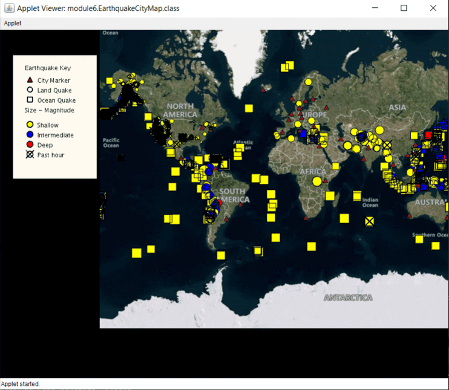

# UCSDUnfoldingMaps
This project is an interactive GUI that displays earth quack data on a map that is built using UnfoldingMaps library. 
## Introduction   

This application is a project I have done in the context of the Object-Oriented Programming in Java course offered by UCSSD - Coursera.
The final version and complete version are in the src-module6 folder. other modules represent building one feature of the application at a time.    

## Demo

## Features      

1- Displaying earthquakes on the map.
2- By clicking on a city, all other earthquakes will disappear except the one(s) that affects that city, and a little box will appear showing information about the earthquakes.
3- By clicking on earthquakes, all other earthquakes will disappear.  All cities will disappear except the one(s) that the earthquake affects.
4- Zoom in/out using mouse/ keyboard.
5- Surfing the map using the mouse/keyboard.
6 - Sorting the earthquakes according to their magnitude.
7- Count the number of earthquakes that every country had.

## UML diagram for Class hierarchy 

## Requirements
- Java 1.8 JDK
## TroubleShooting
IMPORTANT: Many issues (including many not listed on this page) can be easily fixed by performing these four fixes listed here. Please try these fixes first before looking for your specific issue. This will help to ensure Eclipse and Java are set up and working properly. 

Make sure Eclipse is using the most current version of Java (see directions below).

Set the compiler compliance level (see directions below).

Ensure UCSDUnfoldingMaps was imported into Eclipse properly (see directions below)

Update your video drivers.

Solutions for the following errors appear below
Checking which version of Java Eclipse is using

Setting the Compiler Compliance level

Receiving "403" error when using Google Maps provider.

The file "http://mt1.google.com/....." is missing or inaccessible...

OpenGL error 1286 at top of endDraw():  invalid framebuffer operation

When I run the applet the window says "Applet Running" but nothing is displayed

"'AWT-EventQueue-1' javax.media.opengl.GLException: Caught..." error when running applet.

"java.lang.UnsupportedClassVersionError...Unsupported major.minor version..." error when running applet

“libEGL warning: failed to create a pipe screen for...” error when running applet

"java.net.SocketException: Address family not supported..." error when running applet

Setting Up a Proxy in Eclipse

  

The following four steps often resolve setup issues.  For additional issues, please see below
  

1. Checking which version of Java Eclipse is using.
Versions of Java older than Version 7 often cause issues with the programs we will write in this course. If you are a Mac user, be aware that OSX comes with Java 6 installed on the system, and when Eclipse is installed it will use this version of Java by default. Please follow these directions to make sure the correct version of Java is being used. 

    1. Under “Preferences” go to Java > Installed JREs.   
    2. You will see listed the versions of Java that Eclipse is using. Check to see that either Java SE 7 (jre1.7) or Java SE 8 (jre1.8) are listed and       checked
  
2. Set the Compiler Compliance Level
The compiler compliance setting in Eclipse will have the compiler "pretend" to be a different version of Java. Sometimes the compiler compliance will be set to an old version of Java when Eclipse is installed for the first time. It is unknown why this happens. Follow these instructions to make sure the compiler compliance is set to the correct version of Java. 

    1. Under “Preferences” go to Java > Compiler. 

    2. Set “Compiler compliance level” to match your version of Java (Java 7 is 1.7, Java 8 is 1.8). If your version of Java is older than Java 7, then     you must update your version of Java. 

    3. Check the box for “Use default compliance settings” then click "Apply". 

    Note: Some issues can be resolved by setting the compiler compliance level to an older version (such as 1.5), clicking "Apply", then setting it back     to the newest version (such as 1.8).

3. Ensure you selected the directory "UCSDUnfoldingMaps" when importing.
If you import a parent directory into Eclipse, you may see almost all classes with a "Red X" and mutliple errors and warnings.  The easiest fix is to delete the copy you added and then re-import UnfoldingMaps, carefully following the instructions from the "Setting Up UnfoldingMaps" directions.  

4. Update graphics drivers
UnfoldingMaps and processing libraries may rely on up-to-date video drivers.  Updating these drivers can remedy some remaining issues.  

## References
Object Oriented Programming in Java by University of California San Diego Course
